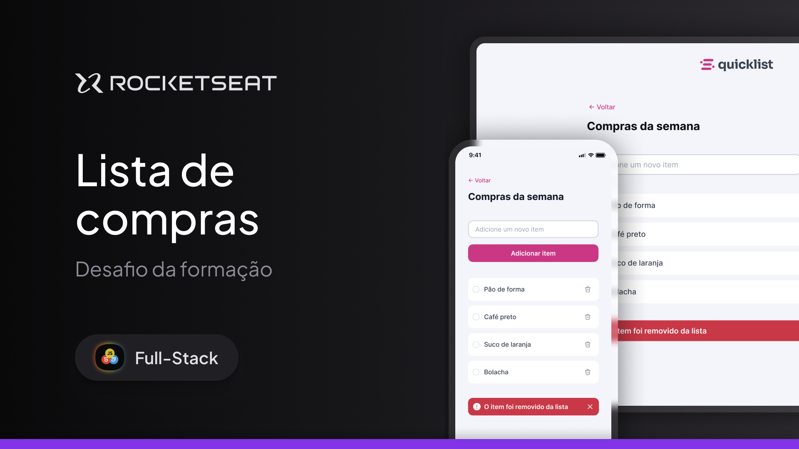

  

<h1 align="center"> Lista de Compras </h1>

Programa exclusivo no curso Full-Stack, promovido pela Rocketseat para ensino de tecnologias WEB, no Modulo Javascript, realizado Desafio para elaboração de cadastrar, remover e validar a Lista de Compras, foi aplicado o JavaScript e suas funções e manipulação html e CSS e validação do campo.

  <a href="#-tecnologias">Tecnologias</a>&nbsp;&nbsp;&nbsp;|&nbsp;&nbsp;&nbsp;
  <a href="#-Projeto">Projeto</a>&nbsp;&nbsp;&nbsp;|&nbsp;&nbsp;&nbsp;
  <a href="#-layout">Layout</a>&nbsp;&nbsp;&nbsp;

 

  

## 🚀 Tecnologias

Esse projeto foi desenvolvido com as seguintes tecnologias:

- HTML e CSS
- Git e Github
- Figma
- JavaScript

## 💻 Projeto

Voce pode visualizar o projeto pronto projeto através [DESSE LINK](https://ricardotavaresdias.github.io/LISTA-DE-COMPRA/)
O Projeto Lista de Compras é um agregador de ensino na Rocketseat para avançar o conhecimento em JavaScript. Nesse modulo foi aplicado o JavaScript e suas funções e manipulação html e CSS e validação do campo.

## 🔖 Layout

Você pode visualizar o layout do projeto através [DESSE LINK](https://www.figma.com/community/file/1397279978314668489). É necessário ter conta no [Figma](https://figma.com) para acessá-lo.

---

Rocketseat: [Participe da nossa comunidade!](https://www.rocketseat.com.br/)
